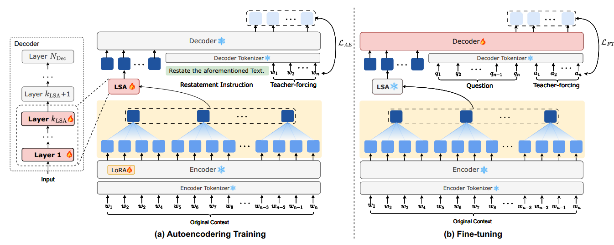
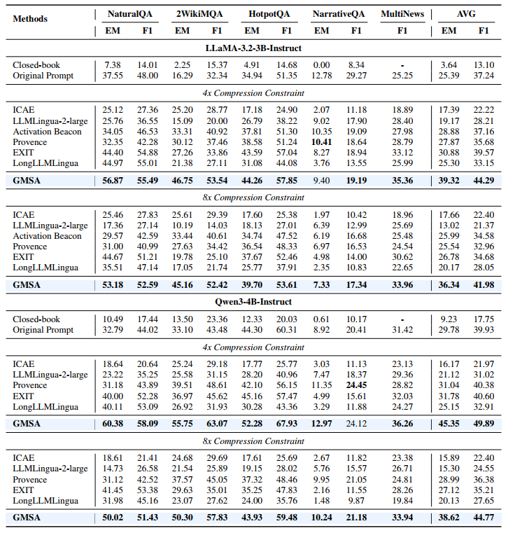

<div align="center">

<h2>GMSA: Enhancing Context Compression via Group Merging and Layer Semantic Alignment</h2>

<p>
  <a href="https://scholar.google.com/citations?user=v7oMH04AAAAJ&hl=zh-CN">Jiwei Tang</a><sup>1*</sup> ·
  Zhicheng Zhang<sup>1*</sup> ·
  Shunlong Wu<sup>1</sup> ·
  Jingheng Ye<sup>1</sup> ·
  Lichen Bai<sup>1</sup> ·
  Zitai Wang<sup>1</sup> ·
  Tingwei Lu<sup>1</sup> ·
  Lin Hai<sup>1</sup> ·
  Yiming Zhao<sup>4</sup> ·
  Hai-Tao Zheng<sup>1,2†</sup> ·
  Hong-Gee Kim<sup>3</sup>
</p>
<p>
  <sup>1</sup> Tsinghua University · <sup>2</sup> Pengcheng Laboratory ·
  <sup>3</sup> Seoul National University · <sup>4</sup> Sun Yat-sen University
</p>

</div>

<div align="center">
  <a href="https://arxiv.org/abs/2505.12215">
    
  </a>
</div>

This is the official implementation of the paper **“GMSA: Enhancing Context Compression via Group Merging and Layer Semantic Alignment.”** GMSA is an encoder-decoder context compression framework that represents a long context as a compact sequence of soft tokens for downstream generation.

## Motivation

Long-context LLM inference suffers from high attention cost and substantial information redundancy. Existing soft-prompt compressors often learn summary vectors through a small set of appended tokens, which can overemphasize a few anchor tokens during autoencoder pretraining. They also directly feed high-level encoder representations into low-level decoder input space, leaving a cross-layer semantic gap that a simple projection may not adequately bridge.

GMSA addresses these problems with uniform **Group Merging** and a Transformer-based **Layer Semantic Alignment (LSA)** module.

## Method

The framework uses a causal language model as both encoder and decoder:

- **Group Merging:** the encoder produces token-level hidden states, divides consecutive states into equal-sized groups, and mean-pools every group into one soft token. Uniform aggregation reduces semantic dominance and makes `merge_size` the approximate compression ratio.
- **Layer Semantic Alignment:** a shallow stack of decoder-initialized Transformer blocks maps high-level compressed semantics into the decoder's lower-level input space.
- **Two-stage training:** autoencoder pretraining trains the encoder LoRA parameters and LSA to reconstruct the original context; downstream fine-tuning freezes the compressor and trains the decoder to generate task answers.
- **Generation:** compressed memories are followed by the uncompressed task prompt and consumed by the decoder.

<div align="center">
  
  <p>Compression Process of GMSA.</p>
</div>

## Main Results

The paper evaluates GMSA on context reconstruction, long-context question answering, and summarization using two backbone model families. It reports stronger reconstruction fidelity than existing soft-prompt autoencoders and improved downstream performance under multiple compression budgets. The efficiency analysis reports approximately 5× end-to-end acceleration over the original prompt on NaturalQuestions at 32× compression. See the [paper](https://arxiv.org/abs/2505.12215) for complete tables, ablations, and latency settings.

<div align="center">
  
  <p>Results of GMSA.</p>
</div>

## Environment Setup

The project is designed for NVIDIA GPUs, BF16, and FlashAttention 2. A reference environment matching the current GMSA stack is:

```bash
conda create -n gmsa python=3.10 -y
conda activate gmsa

pip install torch==2.4.0 torchvision==0.19.0 torchaudio==2.4.0 --index-url https://download.pytorch.org/whl/cu118
pip install \
  transformers==5.1.0 datasets==4.3.0 peft==0.13.0 \
  deepspeed==0.18.7 accelerate==1.13.0 safetensors==0.7.0 \
pip install flash-attn==2.6.3 --no-build-isolation
```
## Data Format

Both stages load JSONL data. Each line uses the following schema:

```json
{
  "input": "Long context text...",
  "prompt": "Question text...",
  "answer": ["reference answer", "optional alternative answer"]
}
```

- `input` is required by both stages. Autoencoding reconstructs this field.
- `prompt` and `answer` are required by instruction fine-tuning and inference.
- `answer` can be a string or a list of strings. 

 Override `TRAIN_FILE` and `TEST_FILE` for datasets.

## Two-Stage Training

The provided launcher runs autoencoding and then instruction fine-tuning:

```bash
bash gmsa_all.sh
```

For full-data training, invoke each entry point with `--debug_data False`:


## Inference and Evaluation

Evaluate a fine-tuned checkpoint with `test.sh`:

```bash
bash test.sh
```

If `RESTORE_FROM` is empty, inference uses the initialized base-model weights. A checkpoint path may point to a file, a directory containing a supported weight file, or an output directory containing `checkpoint-*` subdirectories; the latest numbered checkpoint is selected when needed. 


## Main Launcher Variables

| Variable | Default | Description |
| --- | --- | --- |
| `BASE_MODEL` | `Qwen/Qwen3-4B-Instruct-2507` | Training model identifier/path. `test.sh` uses `BASE_MODEL` as well. |
| `TRAIN_FILE` | `/path/to/train.jsonl` | Training JSONL. |
| `TEST_FILE` | `/path/to/test.jsonl` | Evaluation JSONL. |
| `MERGE_SIZE` | `16` | Tokens per pooled memory representation. |
| `MERGE_SIZES` | `16,32` | Candidate sizes when random compression is enabled. |
| `IS_RANDOM` | `False` | Randomly sample a merge size per batch. |
| `USE_TRANSFORM_LAYER` | `True` | Use the memory-fusion model instead of linear alignment. |
| `NUM_MEM_FUSION_LAYERS` | `1` | Number of fusion-model decoder blocks. |
| `LORA_R` / `LORA_ALPHA` | `128` / `32` | Encoder LoRA rank and scaling. |
| `AE_MAX_STEPS` / `FT_MAX_STEPS` | `5000` / `10000` | Steps in the provided debug launcher. |
| `NPROC_PER_NODE` | `2` | Number of distributed training workers. |
| `MODEL_MAX_LENGTH` | `280000` | Sequence limit used by both launchers. |
| `EVAL_SAMPLES` | `100` | Evaluation row limit; `-1` means all. |


## BibTeX

If you find this repository useful, please cite the paper:

```bibtex
@article{DBLP:journals/corr/abs-2505-12215,
  author       = {Jiwei Tang and
                  Zhicheng Zhang and
                  Shunlong Wu and
                  Jingheng Ye and
                  Lichen Bai and
                  Zitai Wang and
                  Tingwei Lu and
                  Jiaqi Chen and
                  Lin Hai and
                  Hai{-}Tao Zheng and
                  Hong{-}Gee Kim},
  title        = {{GMSA:} Enhancing Context Compression via Group Merging and Layer
                  Semantic Alignment},
  journal      = {CoRR},
  volume       = {abs/2505.12215},
  year         = {2025}
}
```
